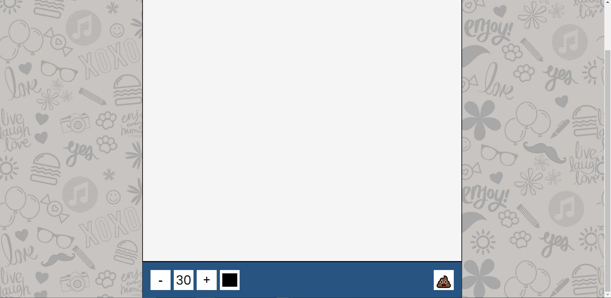

# drawing-App
This project is a drawing app. Build using JavaScript, Canvas element in HTML and CSS.

Live demo of this project
https://pulasthi-nanayakkara.github.io/MovieApp/

                                               reference
10 JavaScript Projects in 10 Hours - Coding Challenge
https://youtu.be/dtKciwk_si4

HTML5 Canvas drawing application on Github pages (beginner-friendly tutorial) 
https://levelup.gitconnected.com/html5-canvas-drawing-application-on-github-pages-beginner-friendly-tutorial-5d50b99adb6a

                                               Screenshots
                                               
 
 
